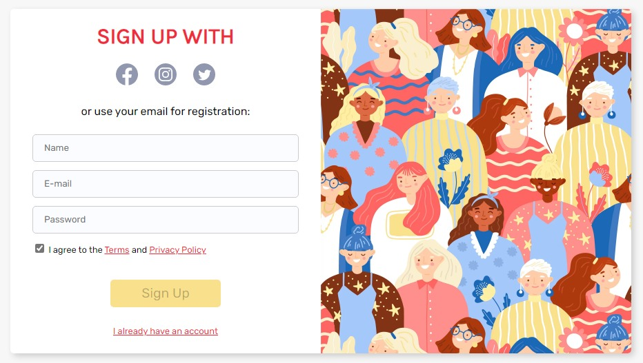

# Frontend exercise: Sign Up Form

Live Site URL: [https://arthurvmdantas.github.io/signupform/]()

This is a frontend exercise built with HTML/SASS/Javascript + Parcel (bundling).

The design is responsive (mobile-first) and the styles follow the BEM name standard.

For the form validation, I'm making use of the [Constraint validation](https://developer.mozilla.org/en-US/docs/Web/API/Constraint_validation) WEB API. I used that same API for custom validation messages to the user - messages are displayed natively by the browser (they aren't DOM nodes). The password must have at least one capital letter; it uses pattern (regular expression) validation.

## Author 👨‍💻

- Website - [https://arthurvmdantas.work](https://arthurvmdantas.work)
- Frontend Mentor - [@arthurvmdantas](https://www.frontendmentor.io/profile/arthurvmdantas)
- Twitter - [@arthurvmdantas](https://www.twitter.com/arthurvmdantas)